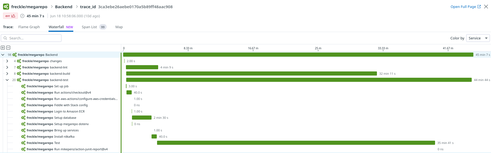

# Trace Workflows

This action fetches timing data about a GitHub Workflow and records it as a
trace,

```
[ Backend                                                            ]
  [ test                                          ] [ lint         ]
    [ actions/checkout ] [ freckle/stack-action ]    [ hlint ]
```

## Work In Progress

So far we have a Haskell executable that fetches this data, builds up the spans
and emits them using the OpenTelemetry SDK. This requires an `otel-collector`
side-car (or other service) to receive and process the trace data, for example
sending it to Datadog.



The `docker-compose.yml` in this repository can run such a collector. This
container as well as the action itself, make use of `.env`. See `.env.example`.

## Next Steps

In order to make this work we'd need to:

1. Either rewrite in TypeScript (see `pb/ts` branch), or dockerize for use as a
   Docker-based action
2. Figure out how to best run a collector side-car on Actions and document that
